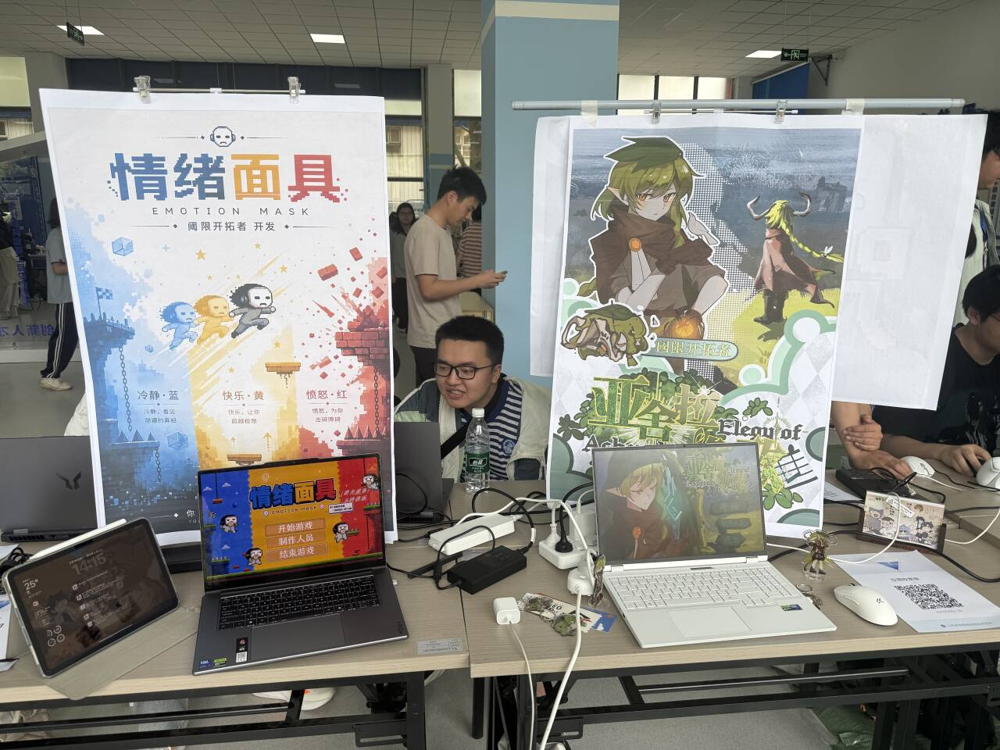
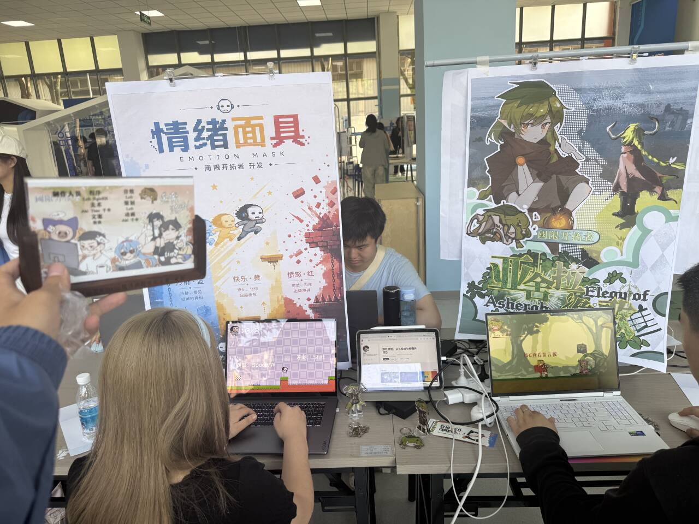
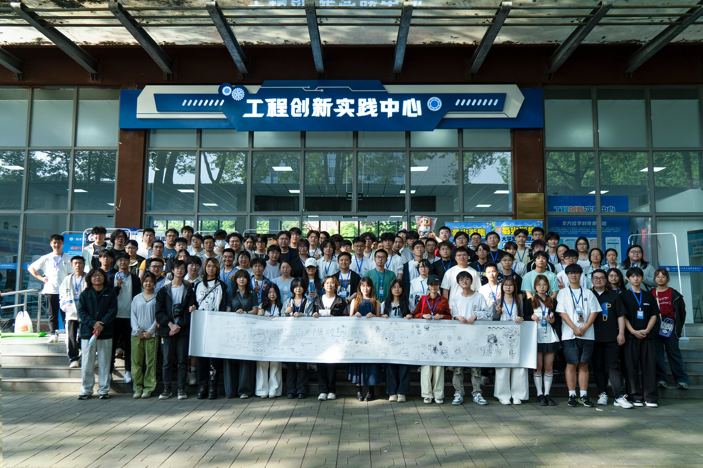

5 月 16 日，我带着《Emotion Mask》和《亚舍拉挽歌》参加了成都第一届《蜀光游集》线下路演。

这是由卢德工作室主办、成都工业大学承办的一次校园游戏展。现场聚集了来自 16 所学校的 50 多款游戏，展位之间的气氛很密集：有人在展示完整 Demo，有人在测试手感，有人在给陌生玩家讲世界观，也有人只是站在旁边看几分钟，就会忍不住问一句“这个能不能玩”。

对我来说，这次路演不是单纯把作品摆出来，而是一次很直接的压力测试。电脑、海报、鼠标键盘和试玩排队的人都摆在面前时，游戏里那些平时自己已经习惯的操作、提示、节奏问题，会被玩家非常真实地指出来。

## 两款作品的现场展示

这次展出的两款作品分别是：

- 《Emotion Mask》：围绕情绪面具切换展开的 2D 平台跳跃解谜游戏。
- 《亚舍拉挽歌》：以资源管理、路线规划和多结局为核心的 2D 平台跳跃 / 资源管理游戏。

《Emotion Mask》放在左侧展位，用海报解释“冷静、快乐、愤怒”三种面具的能力差异；《亚舍拉挽歌》放在右侧，用角色视觉和标题海报强调世界观与美术风格。两个游戏都提供了现场可玩的版本，玩家可以直接坐下来试玩，我则在旁边观察他们第一次接触游戏时的反应。

当天两个游戏来来回回大约有近 100 人体验。比较意外的是，《Emotion Mask》的吸引力比我预想中更强：很多玩家会先被“情绪切换”这个概念吸引，然后在试玩过程中继续追问后续版本会不会更新更多面具、更多关卡，甚至后来还拉起了一个粉丝催更群。

## 《Emotion Mask》的反馈

《Emotion Mask》目前展出的仍然是较早版本，但现场反馈证明它的核心概念是成立的。

玩家最容易记住的是“不同情绪对应不同能力”这件事。冷静用于观察，快乐用于机动，愤怒用于破坏，这种规则不需要很长的剧情铺垫，只要进入关卡、切换几次状态，就能让玩家理解游戏想表达什么。

现场反馈主要集中在几个方向：

1. 手感还需要继续优化。  
   有玩家觉得跳跃、移动和切换之间还可以更顺，尤其是在连续平台、尖刺和墙体附近，操作反馈需要更稳定。

2. 视角移动是接下来必须处理的问题。  
   平台跳跃游戏里，玩家很依赖镜头提前看到危险和落点。如果镜头跟随不够舒服，玩家会把失败归因到“不知道前面有什么”，而不是自己的判断失误。

3. 面具系统值得扩展。  
   现场有人明确期待后续不只有冷静、快乐、愤怒三种面具，而是加入更多面具，让关卡解法变得更丰富。

4. 切换方式可以更清晰。  
   目前按键切换还能用，但如果面具数量增加，只靠顺序轮换会变慢。后续可以保留原有切换方式，同时给不同面具分配独立快捷键，让熟练玩家可以快速切换。

5. 手柄适配可以列入后续方向。  
   有玩家提到是否考虑手柄适配。我的判断是：键盘仍然是当前版本最稳的输入方式，但如果游戏继续扩展，手柄适配值得提前预留输入层设计，至少不要把后续接入做死。

这次路演让我更确定，《Emotion Mask》不是一个只能停留在 Game Jam 原型里的点子。它最有价值的地方，是把抽象的情绪状态变成了可以操作、可以失败、可以被玩家讨论的机制。接下来更新时，我会优先处理“手感、镜头、面具扩展、按键结构”这四件事。

## 《亚舍拉挽歌》的反馈

《亚舍拉挽歌》的问题更集中在“引导”上。

这款游戏本身比《Emotion Mask》更复杂。它不只是跳平台，还包含灵能消耗、地上 / 地下切换、路线规划、遗骨资源、捷径建造和结局结算。对开发者来说，这些系统彼此之间是连在一起的；但对第一次坐到电脑前的玩家来说，他们面对的是一套还没建立认知的规则。

现场能明显观察到：只要玩家理解了“地下收集资源，地上规划攀登，灵能既是生命也是结局评价”这个循环，他们就能进入游戏；但如果前几分钟没有被带进去，就容易不知道下一步该干什么。

所以《亚舍拉挽歌》接下来的更新重点不是继续堆新系统，而是加强前段引导：

1. 开场目标要更明确。  
   玩家进入游戏后，应该尽快知道自己要去哪里、为什么要收集、什么时候该返回地上。

2. 第一次地上 / 地下切换需要更强提示。  
   这是游戏的核心节奏，不能只靠玩家自己摸索。可以通过场景标识、角色台词、UI 提示和关卡路线共同引导。

3. 资源用途要分阶段出现。  
   灵能、遗骨、捷径和结局评价不适合一口气全部讲完。应该先让玩家完成一次小循环，再逐步开放更复杂的资源决策。

4. 失败反馈要更像“我知道下次怎么做”。  
   如果玩家死亡或灵能不足，游戏应该让他明白问题出在路线、时间、资源消耗还是操作，而不是只把他送回重来。

这次反馈也提醒我：《亚舍拉挽歌》的气质是成立的，但它需要更耐心地把玩家带进规则里。它不像《Emotion Mask》那样可以用一个简单动作快速建立理解，而是更依赖前 3 分钟的教学节奏。

## 路演给我的几个判断

线下试玩和线上评论很不一样。线上反馈往往是玩家已经玩过一段时间后总结出来的，而线下反馈会把“第一次接触”的过程完整暴露出来。

我在现场看到很多细节：

- 玩家会不会被海报和标题吸引。
- 玩家坐下后第一眼看哪里。
- 玩家遇到第一个障碍时会不会犹豫。
- 玩家失败后是继续尝试，还是立刻站起来。
- 玩家试玩结束后，愿不愿意问“之后会不会更新”。

这些反应比单纯的下载量更具体。尤其是当很多人愿意试玩、愿意提建议、甚至愿意加入催更群时，它说明作品至少已经有了让人想继续等待的部分。

## 接下来的更新计划

这次路演之后，我给两个项目整理了不同优先级。

《Emotion Mask》的下一步：

- 优化移动、跳跃、冲刺和面具切换的手感。
- 调整镜头跟随，减少视野不足导致的误判。
- 增加关卡前段的轻量提示，让玩家更快理解三种面具的用途。
- 设计更多面具原型，并评估它们是否能带来新的关卡解法。
- 为多面具版本预留独立快捷键和输入映射。
- 继续维护 TapTap 页面和玩家反馈群，收集更具体的试玩问题。

《亚舍拉挽歌》的下一步：

- 重做前段引导，让玩家更早理解核心循环。
- 把复杂规则拆成几次可完成的小目标。
- 强化地上 / 地下切换的视觉提示和文本提示。
- 优化资源反馈，让灵能、遗骨、捷径与结局之间的关系更直观。
- 调整早期关卡路线，降低第一次试玩时的迷路成本。

这次《蜀光游集》对我最大的意义，是让我更清楚地看到：一个游戏有没有潜力，不只看它的设定是不是完整，也看陌生玩家愿不愿意在几分钟内理解它、挑战它，并且在离开展位后还记得它。

从这个角度来说，《Emotion Mask》和《亚舍拉挽歌》都还没有完成，但它们都已经给了我继续往下做的理由。
