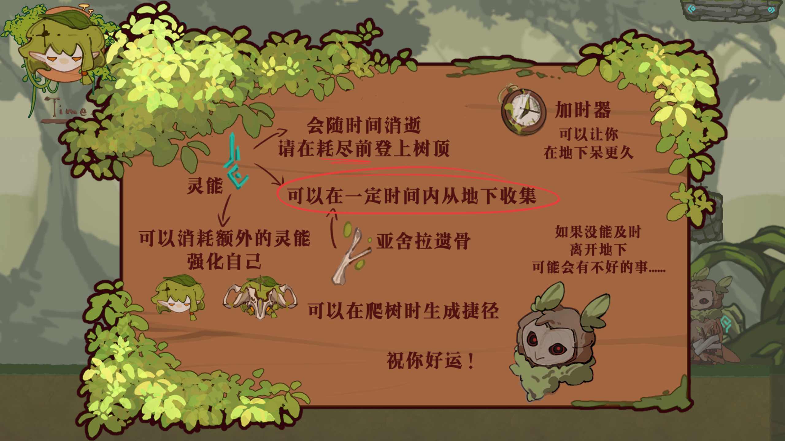
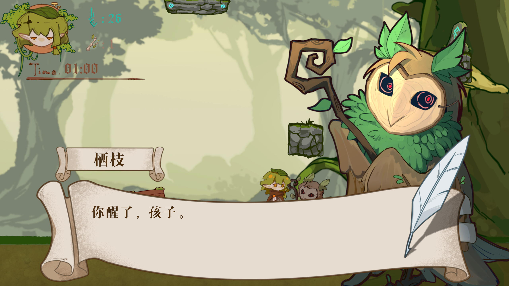
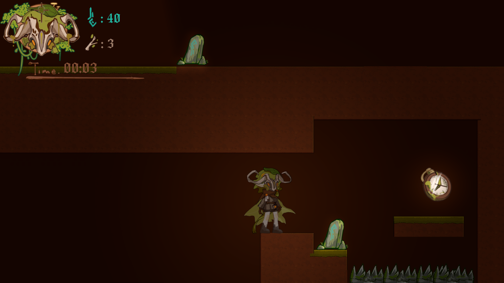
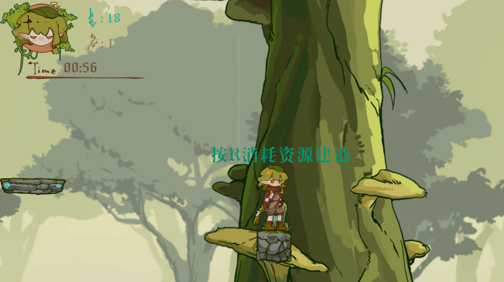
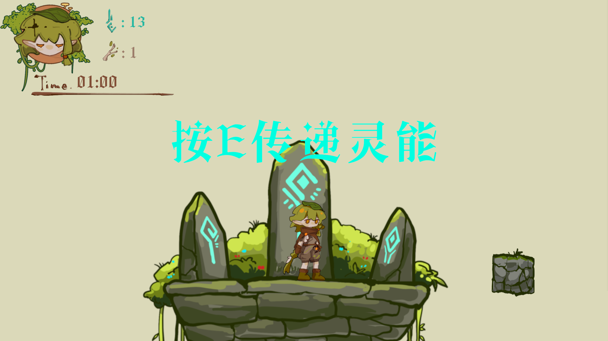
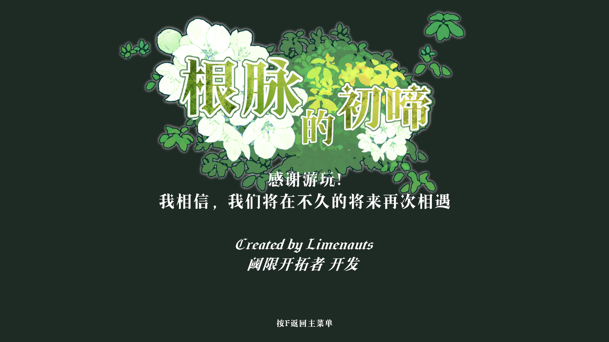
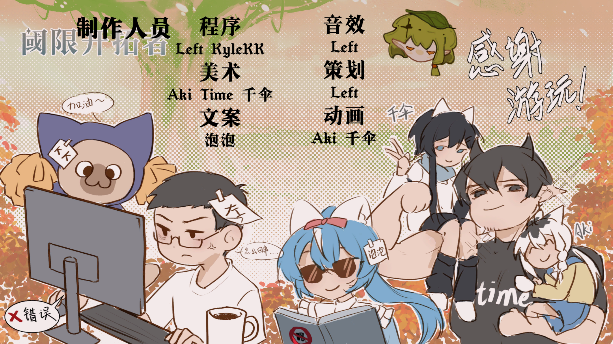

## 项目简介

《亚舍拉挽歌》是我们团队为腾讯高校游戏极限开发大赛成都赛点制作的 2D 平台跳跃 / 资源管理游戏。玩家扮演最后的“根语者”，在生命之树“亚舍拉”即将枯竭的世界中往返于地下根脉与地上树干之间，收集残存灵能、规划攀登路线，并在自身灵能燃尽前把最后的力量送往世界之心。

这个项目的核心不是单纯“跑得快”或“跳得准”，而是在时间、资源和风险之间做管理决策。玩家需要判断什么时候深入地下收集，什么时候返回地上攀登，什么时候消耗资源建造捷径，什么时候为了效率切换更高风险的形态。

## 世界观与叙事

故事发生在“大枯萎纪”。曾经，生命之树亚舍拉的根须深入地心，枝冠触及群星，灵能从祂的经脉中流动，维系万物的生命循环。随着灵能泉眼逐一枯竭，森林褪色，文明离散，母树也走向弥留。

玩家是最后的根语者，也是这个衰亡世界最后的管理者。史诗英雄早已离场，剩下的是一次次具体而微的抉择：多收集一点灵能，还是尽快返回安全区域；把遗骨用于建造捷径，还是保留资源以应对后续路线；以更快速度推进，还是避免灵能流失过快。

在这个设定里，“管理”不是抽象主题，而是世界即将沉寂时仍试图维持秩序的行动本身。

## 核心玩法

游戏由两个互相衔接的循环组成。

- 地下探索：玩家在严格时间限制内进行平台跳跃，收集灵能和遗骨。地下路线更紧张，强调操作效率、路径选择和风险判断。
- 地上攀登：玩家利用收集到的资源向母树顶端推进。灵能可以用于行动与攀登，遗骨可以用于建造捷径，减少后续尝试的路线压力。

灵能同时承担生命值、行动能量和结局评价资源的功能。它会随着时间自然流失，也会因为强化形态和关键行动而加速消耗。玩家最终交付的灵能数量会影响结局，从而把资源管理结果直接反馈到叙事收束上。

## 截图与系统展示

告示板用一张图解释灵能、遗骨、加时器、强化状态和捷径建造，让玩家在进入主要循环前快速理解资源压力。

对话系统承担叙事推进和世界观提示。栖枝作为母树意识的残响，在流程中给出规则说明和情绪引导。

地下区域强调时间压力和操作效率。玩家可以进入强化状态提升行动能力，但灵能流逝会更快，必须在收益和风险之间取舍。

地上部分更偏长期规划。玩家可以消耗资源建造捷径，缩短后续攀登路线，把地下收集成果转化为路线优势。

过程提示直接叠加在场景中，用较强的视觉反馈提醒玩家当前行为会消耗或改变核心资源。

不同结局会根据最终交付的灵能数量触发，将玩家的资源管理结果反馈到叙事结局中。

尾声画面把“枯萎之后的新脉动”可视化，回应游戏中关于循环、牺牲与再生的主题。

Staff 表记录了团队分工，也让这次 72 小时协作的完成感有一个明确收束。

## 我负责的部分

- 担任队长、主程、玩法策划与音乐制作，负责推进团队节奏和版本整合。
- 设计并实现核心操作、双形态切换、灵能消耗、收集循环、捷径建造和多结局判定。
- 统筹“地下收集 - 地上攀登 - 结局反馈”的整体流程，让玩法循环和叙事目标保持一致。
- 与文案、美术成员协作，将母树、根语者、大枯萎纪、灵能等概念落到界面、场景和流程中。

## 技术实现

项目使用 Unity 开发，重点是用有限时间搭建一个能支撑完整体验的系统框架。

- 完成移动、跳跃、冲刺、贴墙判定、复活、区域判定和双形态切换。
- 实现灵能值系统，将生命、时间压力、行动成本和结局条件统一到一个核心资源中。
- 实现地下安全时间、地上攀登节奏、资源收集、遗骨消耗和捷径建造逻辑。
- 使用异步场景加载和区域触发器组织地上/地下切换，减少流程割裂感。
- 为多结局设计可调整阈值，让玩家的资源管理结果可以被清晰地结算。

## 系统结构

为了在 72 小时内保证可玩闭环，我把脚本按功能拆成五个核心模块：

- 玩家控制系统：`PlayerMove`、`PlayerJump`、`PlayerDash`、`GroundCheck`、`WallCheck`、`Respawn`，负责平台跳跃的基础手感。
- 形态与灵能系统：`MaskControl`、`EnergyManager`、`EnergyDrainController`、`SafetyTimer`，负责普通 / 强化状态、灵能流逝和地下安全时间。
- 关卡交互系统：`CheckPoint`、`PlatformMove`、`TrapCheck`、`ShortcutBuilder`，负责检查点、机关、陷阱和捷径构建。
- 对话与 UI 系统：`SimpleDialogue`、`AdvancedText`、`UIManager`、`ChoicePanel`，负责文本、交互和界面反馈。
- 场景表现与结局系统：`BackgroundSwitcher`、`CharacterLightController`、`MusicManager`、`EndingManager`，负责背景、灯光、音乐和结局切换。

玩家行为会从输入、移动、跳跃、冲刺进入地面/墙体/受伤判定，再联动形态切换、灵能状态、地下安全时间、机关反馈和最终结局。这个结构让玩法、资源、对话和表现可以在短开发周期里保持相对清晰。

## 设计亮点

《亚舍拉挽歌》最有价值的地方，是把主题、机制和叙事压在同一个核心上。灵能的流失对应世界的衰亡，地下限时探索制造压力，地上规划提供喘息与选择，多结局则回应玩家一路以来的管理成果。

这让游戏的每一次跳跃和每一次资源消耗都不只是操作行为，也带着“是否还来得及挽回什么”的叙事重量。
