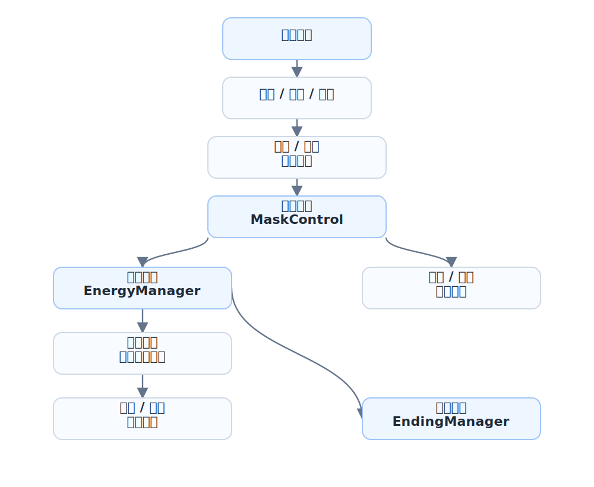

## 项目简介

我以阈限开拓者队名带队参加腾讯高校游戏极限开发大赛成都赛点，并在 72 小时内推进完成《亚舍拉挽歌》这款 2D 平台跳跃 / 资源管理游戏。我在团队中担任队长、主程、玩法策划和音乐制作，负责把资源管理、双形态切换、地上/地下循环和多结局结算落到可玩的版本里。玩家扮演最后的“根语者”，在生命之树“亚舍拉”即将枯竭的世界中往返于地下根脉与地上树干之间，收集残存灵能、规划攀登路线，并在自身灵能燃尽前把最后的力量送往世界之心。

这个项目的核心不是单纯“跑得快”或“跳得准”，而是在时间、资源和风险之间做管理决策。玩家需要判断什么时候深入地下收集，什么时候返回地上攀登，什么时候消耗资源建造捷径，什么时候为了效率切换更高风险的形态。

## 世界观与叙事

故事发生在“大枯萎纪”。曾经，生命之树亚舍拉的根须深入地心，枝冠触及群星，灵能从祂的经脉中流动，维系万物的生命循环。随着灵能泉眼逐一枯竭，森林褪色，文明离散，母树也走向弥留。

玩家是最后的根语者，也是这个衰亡世界最后的管理者。史诗英雄早已离场，剩下的是一次次具体而微的抉择：多收集一点灵能，还是尽快返回安全区域；把遗骨用于建造捷径，还是保留资源以应对后续路线；以更快速度推进，还是避免灵能流失过快。

在这个设定里，“管理”不是抽象主题，而是世界即将沉寂时仍试图维持秩序的行动本身。

## 核心玩法

游戏由两个互相衔接的循环组成。

- 地下探索：玩家在严格时间限制内进行平台跳跃，收集灵能和遗骨。地下路线更紧张，强调操作效率、路径选择和风险判断。
- 地上攀登：玩家利用收集到的资源向母树顶端推进。灵能可以用于行动与攀登，遗骨可以用于建造捷径，减少后续尝试的路线压力。

灵能同时承担生命值、行动能量和结局评价资源的功能。它会随着时间自然流失，也会因为强化形态和关键行动而加速消耗。玩家最终交付的灵能数量会影响结局，从而把资源管理结果直接反馈到叙事收束上。

## 截图与系统展示

告示板用一张图解释灵能、遗骨、加时器、强化状态和捷径建造，让玩家在进入主要循环前快速理解资源压力。

对话系统承担叙事推进和世界观提示。栖枝作为母树意识的残响，在流程中给出规则说明和情绪引导。

地下区域强调时间压力和操作效率。玩家可以进入强化状态提升行动能力，但灵能流逝会更快，必须在收益和风险之间取舍。

地上部分更偏长期规划。玩家可以消耗资源建造捷径，缩短后续攀登路线，把地下收集成果转化为路线优势。

过程提示直接叠加在场景中，用较强的视觉反馈提醒玩家当前行为会消耗或改变核心资源。

不同结局会根据最终交付的灵能数量触发，将玩家的资源管理结果反馈到叙事结局中。

尾声画面把“枯萎之后的新脉动”可视化，回应游戏中关于循环、牺牲与再生的主题。

Staff 表记录了团队分工，也让这次 72 小时协作的完成感有一个明确收束。

## 我负责的部分

- 担任队长、主程、玩法策划与音乐制作，负责把 72 小时内的创意、关卡、文案、美术和程序整合成可运行版本。
- 主导核心循环设计：地下限时收集、地上攀登推进、遗骨建造捷径、最终灵能交付和多结局反馈。
- 负责主要 gameplay 代码，包括角色移动、跳跃、冲刺、形态切换、灵能流失、安全时间、资源拾取、捷径建造和结局判定。
- 将“灵能逐渐枯竭”的叙事概念落成可调参数：不同区域、不同形态、不同剩余时间都会改变资源压力。
- 与文案、美术成员协作，把母树、根语者、大枯萎纪、栖枝、灵能等设定转译为 UI 提示、场景反馈和流程节点。

## 技术实现

项目使用 Unity 与 C# 开发。我的实现重点不是堆叠功能，而是把“资源管理”做成一个能被多个系统共享的状态中心。
整理系统结构时，我把链路压成三类输入：玩家按键、角色所在区域、资源触发器。按键进入移动 / 跳跃 / 冲刺与形态切换；区域状态决定地下安全时间和灵能流失；触发器负责拾取、捷径、对话和结局。这样写的好处是，即使 72 小时内不断改关卡，也能把问题定位到“输入层、状态层、输出层”中的某一段，而不是在全部脚本里乱找。

- `EnergyManager` 维护灵能值和遗骨碎片，并通过事件把数值变化同步给 UI、形态显示和结算逻辑。
- `EnergyDrainController` 根据玩家 Y 坐标、当前形态和 `SafetyTimer` 剩余时间计算灵能流失速率：地上、地下安全期、地下危险期和强化状态都有不同消耗。
- `SafetyTimer` 用 Y 轴阈值判断玩家是否在地下，只在地下倒计时；加时器道具可以把地下探索风险转化为可争取的时间。
- `MaskControl` 把普通 / 强化状态接入移动速度、跳跃、二段跳、贴墙跳、冲刺和角色/背景视觉，让状态切换影响操作手感与场景表现。
- `ShortcutBuilder` 用遗骨和灵能作为建造成本，玩家进入触发区并按键后才会打开捷径，同时处理资源不足提示。
- `EndingManager` 读取最终灵能值，用可调阈值触发高 / 中 / 低结局；灵能耗尽时会进入死亡结局，并在结局流程中禁用玩家控制、切换音乐和加载返回场景。
- 菜单、重开、结局返回使用 `SceneManager.LoadScene` 管理场景流转；主玩法内部的地上 / 地下差异主要通过 Y 轴阈值和触发器完成，不额外增加复杂场景切换成本。

## 系统结构

为了在 72 小时内保证可玩闭环，我把脚本按功能拆成五个核心模块：

- 玩家控制系统：`PlayerMove`、`PlayerJump`、`PlayerDash`、`GroundCheck`、`WallCheck`、`Respawn`，负责平台跳跃的基础手感。
- 形态与灵能系统：`MaskControl`、`EnergyManager`、`EnergyDrainController`、`SafetyTimer`，负责形态参数、资源流失、地下安全时间和灵能阶段视觉。
- 关卡交互系统：`CheckPoint`、`PlatformMove`、`TrapCheck`、`EnergyPickup`、`TimeExtendPickup`、`ShortcutBuilder`，负责检查点、移动平台、陷阱、资源拾取和捷径构建。
- 对话与 UI 系统：`SimpleDialogue`、`AdvancedText`、`UIManager`、`ChoicePanel`、`EnergyValueDisplay`、`EnergyShardDisplay`、`TimerDisplay`，负责文本、选择、资源数值和倒计时反馈。
- 场景表现与结局系统：`BackgroundSwitcher`、`CharacterLightController`、`MusicManager`、`EndingManager`、`TreeTopInteraction`，负责背景、灯光、音乐、结局触发和结局流程。

整理成流程后，核心链路是从玩家输入进入动作判定，再由形态、资源和区域状态共同决定反馈：

这条链路的重点是让灵能成为所有系统都能读懂的中心状态：玩家输入驱动移动 / 跳跃 / 冲刺，区域与触发器改变资源和流程状态，`EnergyManager` 把灵能与遗骨变化分发出去，`MaskControl` 和 UI 根据状态更新表现，最终由 `TreeTopInteraction` 与 `EndingManager` 根据剩余灵能完成结算。这样做的好处是，玩法、资源、对话和表现都围绕同一个核心资源工作，短开发周期里也能保持可调和可读。
落到团队整合上，我把“会频繁变化的关卡内容”和“需要稳定复用的系统脚本”尽量分开：数值通过 Inspector 暴露，捷径和拾取物依赖触发区，结局阈值在 `EndingManager` 里集中配置。这样文案、美术和关卡调整时不用改核心代码，我也能在最后阶段主要处理连线、阈值和流程 bug。

## 设计亮点

《亚舍拉挽歌》最有价值的地方，是把主题、机制和叙事压在同一个核心上。灵能的流失对应世界的衰亡，地下限时探索制造压力，地上规划提供喘息与选择，多结局则回应玩家一路以来的管理成果。

这让游戏的每一次跳跃和每一次资源消耗都不只是操作行为，也带着“是否还来得及挽回什么”的叙事重量。
