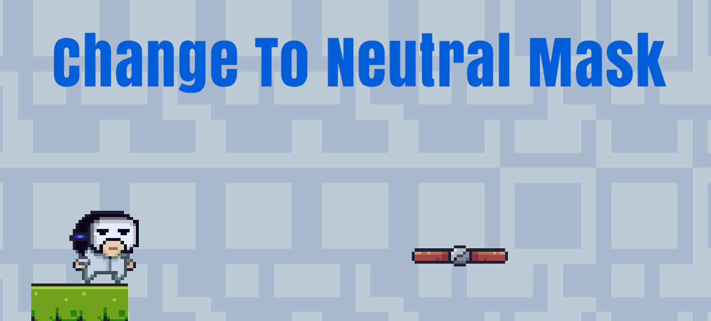
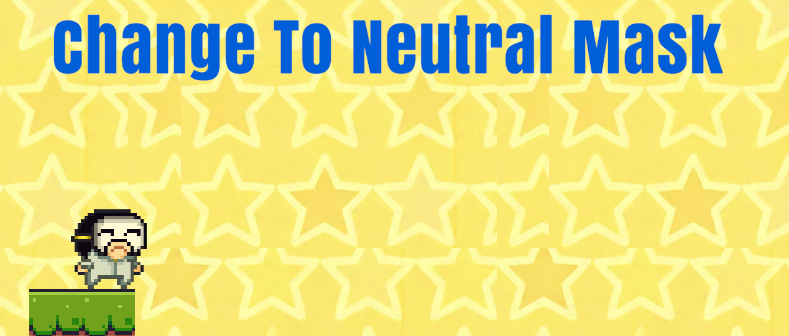
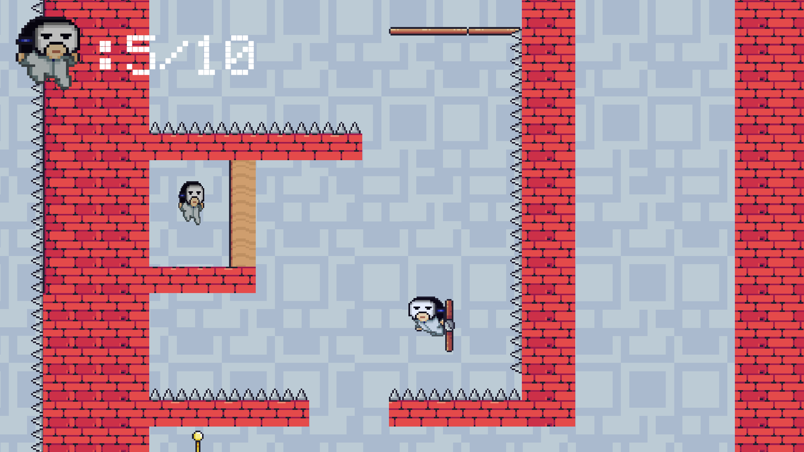
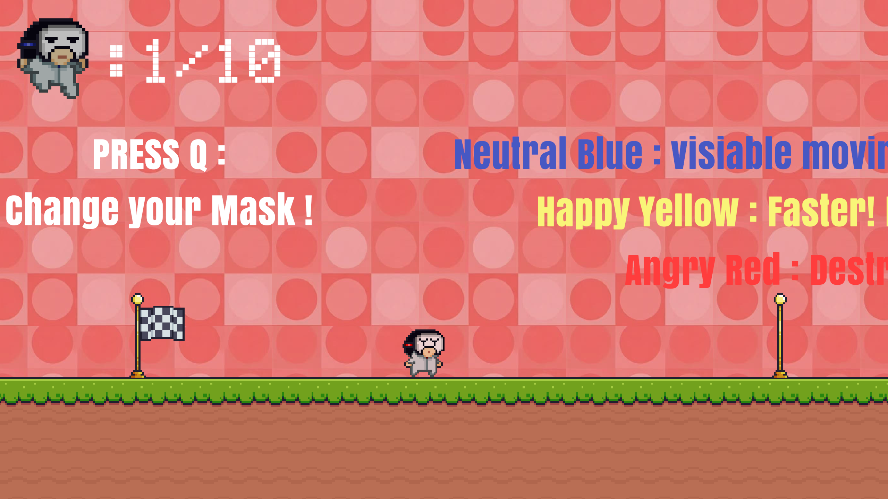

## 项目简介

《Emotion Mask》是一款以“情绪切换”为核心机制的 2D 平台跳跃解谜游戏，也是我在 Global Game Jam 2026 中独立完成的作品。游戏围绕当年主题“Mask”展开：玩家操控一位戴着空白面具的少年，在破碎的内心世界中切换“平静”“快乐”“愤怒”三种情绪状态，用不同能力观察道路、跨越障碍、粉碎阻挡，并收集散落的情绪碎片。

这个项目后来发布到了 TapTap。它对我来说不只是一次 Game Jam 练习，也是第一次把一个从概念、玩法、关卡到发布页面都完整走完的小型商业化展示流程。

## 核心玩法

游戏把“面具”设计成角色能力与关卡解法之间的转换器。每一种情绪不是单纯换皮，而是对应一套操作手感和环境反馈。

- 平静：看破隐藏路径和线索，帮助玩家理解关卡结构。
- 快乐：提升跳跃高度与移动轻盈感，用更强的机动性跨越平台。
- 愤怒：获得冲刺和破坏能力，撞开阻碍路线的障碍。

关卡设计的重点是让玩家意识到：真正的解法不是一直维持某种强能力，而是在不同情绪之间切换，选择当下最合适的状态。

## 截图与机制展示

平静状态下，部分隐藏平台会被显示出来，玩家可以通过观察来找到更安全的路线。

切换到快乐状态后，同一位置的平台不再可见，但角色获得更快的移动节奏。这个对比体现了项目的核心设计：状态不是单纯增益，而是会改变关卡读取方式。

关卡中把尖刺、墙面、移动平台和面具状态组合在一起，让玩家在操作和判断之间持续切换。

教学区域用大字提示三种面具的能力差异：平静可看见移动平台，快乐速度更快，愤怒可以破坏障碍。

## 主题表达

《Emotion Mask》的叙事核心是“接纳不同情绪，才可能靠近完整的自我”。平静、快乐和愤怒都不是绝对正确或错误的状态，它们分别承担观察、行动和突破的功能。玩家在不断切换面具的过程中，也是在重新理解自己与世界的关系。

因此，面具既是玩法工具，也是情绪外化的符号。它把抽象的心理状态变成了可操作、可失败、可重新尝试的游戏机制。

## 我负责的部分

- 独立完成玩法策划、程序开发、关卡设计、像素美术整合、音频整合、构建发布和商店页整理。
- 设计三种情绪面具的能力差异，并把状态切换接入移动速度、跳跃、二段跳、贴墙跳、冲刺次数、角色外观、背景和音乐。
- 实现“状态改变关卡读法”的核心链路：平静显示隐藏平台，快乐强化机动性，愤怒允许冲刺破坏障碍。
- 在 48 小时限制内完成开始菜单、关卡推进、检查点、死亡复活、碎片收集、计时结算和胜利画面。
- 整理 TapTap、Global Game Jam、B 站演示和可执行包所需的介绍、标签、平台信息和展示素材。

## 技术实现

项目使用 Unity 与 C# 开发，重点放在角色控制、状态事件和关卡反馈的快速闭环上。

- `MaskControl` 作为情绪状态中心，维护 `Neutral`、`Happy`、`Angry` 三种状态，并通过 `OnEmotionChangedEvent` 通知平台、音乐和其他反馈系统。
- 每个情绪都有独立的 `EmotionStats`，会同步写入 `PlayerMove`、`PlayerJump` 和 `PlayerDash`，让移动速度、跳跃力、二段跳、贴墙跳、冲刺速度、冷却和空中冲刺次数跟随状态改变。
- 平静状态通过 `neutralPlatforms` 和 `EmotionalPlatform` 控制隐藏平台的显示和碰撞；切换离开平静时会解除玩家与平台的父子关系，避免平台被隐藏后把玩家一起带走。
- 愤怒状态与冲刺系统联动：`PlayerDash` 判断当前是否为 `Angry`，`Hurtcheck` 只有在愤怒且正在冲刺时才调用 `BreakableTilemap` 或障碍动画完成破坏。
- 死亡与复活由 `Hurtcheck`、`CheckPoint`、`GetRespawn` 串起来：陷阱触发死亡动画后回到最近检查点，避免失败直接打断关卡节奏。
- 碎片收集由 `Hurtcheck` 通知 `GameManager`，达到目标数量后停止计时、记录排行榜、锁定玩家控制、切换结局音乐并显示胜利流程。

## 系统结构

项目脚本主要拆成五个模块：

- 玩家控制系统：`PlayerMove`、`PlayerJump`、`PlayerDash`、`GroundCheck`、`WallCheck`，负责平台跳跃手感和冲刺行为。
- 面具切换与表现系统：`MaskControl`、`MaskAnimator`、`EmotionalPlatform`、`MusicManager`，负责状态、外观、平台显隐和音乐切换。
- 关卡交互系统：`CheckPoint`、`GetRespawn`、`Hurtcheck`、`TrapCheck`、`PlatformMove`、`BreakableTilemap`、`CollectibleRotation`，负责失败、复活、移动平台、障碍破坏和碎片反馈。
- 流程与结算系统：`GameManager`、`GameTimer`、`LevelLeaderboard`、`PlayerCheckpoints`，负责目标碎片、最终用时、关卡排名和流程锁定。
- 菜单与界面系统：`StartMenu`、`GamingMenu`、`SceneLoadButton`、`MapSelector` 与基础 UI 动效，负责开始、暂停、选关、重开和返回。

核心数据流是：玩家按键切换面具，`MaskControl` 更新当前状态和角色参数，再通过事件驱动平台显隐与音乐切换；玩家移动、跳跃和冲刺进入关卡交互，陷阱走复活链路，愤怒冲刺走破坏链路，碎片收集走结算链路。这个结构让 48 小时内的系统足够轻，但每个反馈都能回到“情绪切换”这个核心机制上。

## 发布与反馈

《Emotion Mask》已发布到 TapTap，并同步提交到 Global Game Jam 2026。TapTap 页面展示了游戏简介、平台配置、开发者说明和玩家评分；GGJ 页面记录了项目的 Jam 年份、主题、站点、平台和开发工具。

这次发布让我第一次完整经历了“原型完成之后如何被别人看到”的过程：不仅要做出能玩的版本，还要思考封面、简介、标签、配置说明和下载入口如何共同呈现作品。
