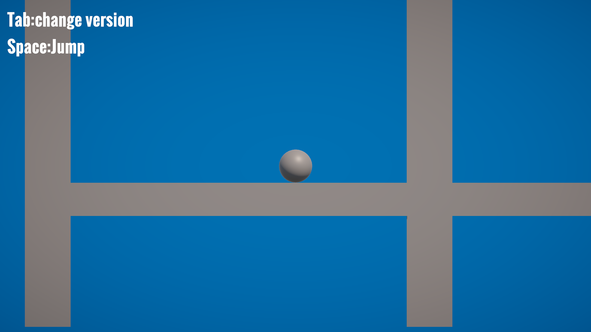
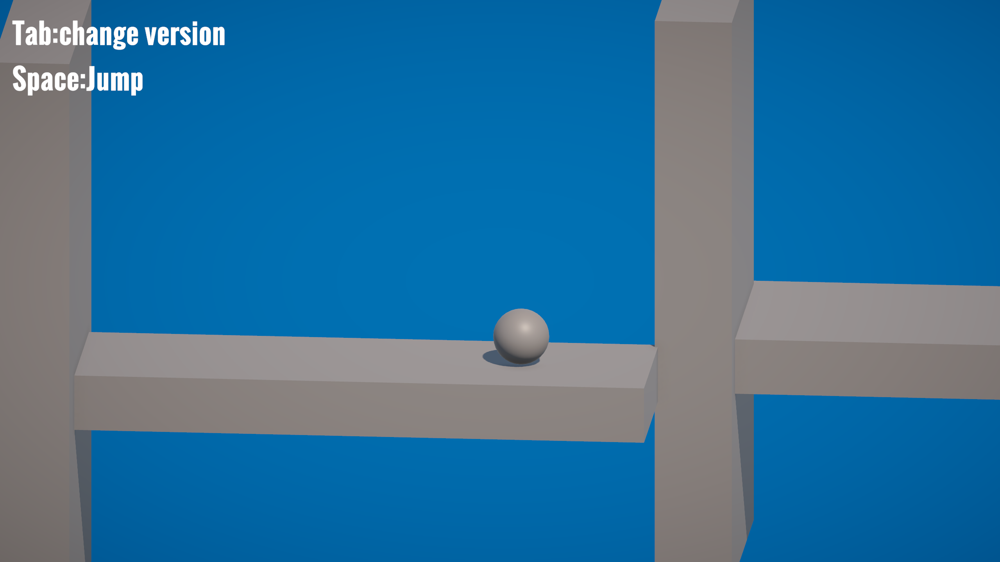

## 项目简介

这是一个二维 / 三维切换解谜原型，我用它来验证“同一关卡在不同空间规则下产生不同解法”这个想法是否成立。

项目灵感来自“dot（点）”这个关键词：点可以是一维的、二维的，也可以是三维空间中的投影。于是我把它转化为一个空间视角原型，让玩家在二维投影和三维场景之间切换，用同一个角色理解不同规则下的道路。

## 截图与机制展示

二维模式下，玩家看到的是类似侧视平台关卡的投影结果，移动被限制在单一平面内，障碍关系更像传统 2D 解谜。

切换到三维后，摄像机和移动规则同步变化。原本在二维中看似阻挡的结构，会因为空间深度被重新理解。

## 我负责的部分

- 单人完成机制设计与原型开发。
- 快速验证维度切换、相机切换与对象行为同步的可行性。

## 技术实现

- 使用 DimensionManager 统一控制维度状态、相机切换与对象行为。
- 让同一个玩家对象在二维和三维规则下切换移动方式。
- 通过碰撞体切换与投影位置修正，让同一场景具备不同解法。

## 系统结构

- 维度切换系统：`DimensionManager` 统一控制二维 / 三维状态，并同步切换 Cinemachine 相机优先级。
- 玩家控制系统：`PlayerMove`、`PlayerJump`、`GroundCheck2D`、`GroundCheck3D` 负责两种空间规则下的移动、跳跃和落地检测。
- 空间物体系统：`DimensionObject` 根据当前维度启用不同碰撞体，并在二维状态下修正玩家投影位置。
- 菜单与流程系统：开始界面、暂停菜单和基础流程控制，保证原型具备可体验闭环。

这个原型的重点不是内容量，而是验证一条清晰链路：玩家按下 `Tab` 后，维度状态切换、相机视角切换、移动轴限制、碰撞规则变化，同一关卡因此产生新的空间解法。
