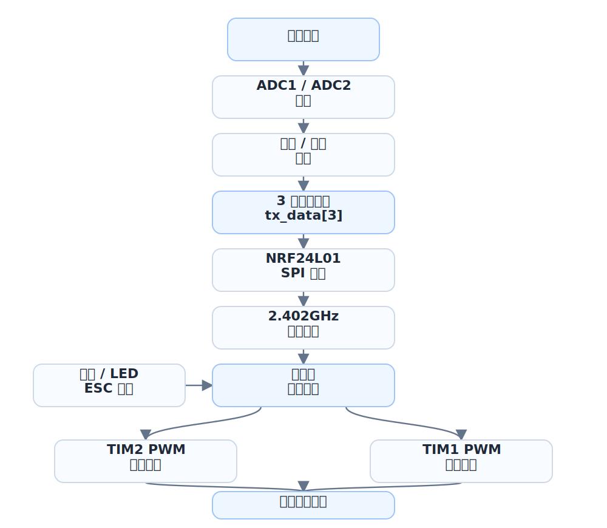
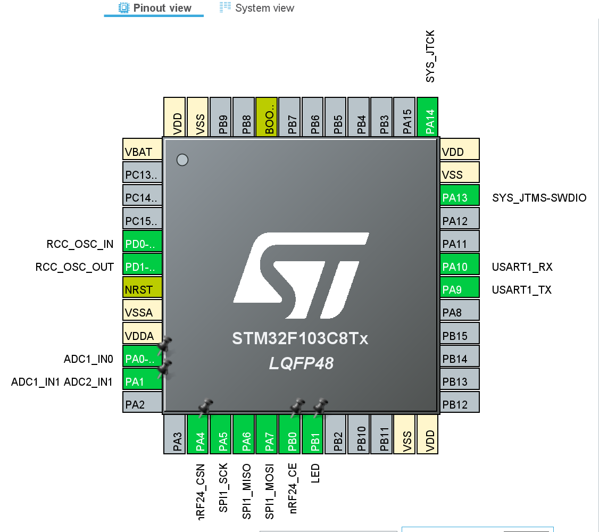
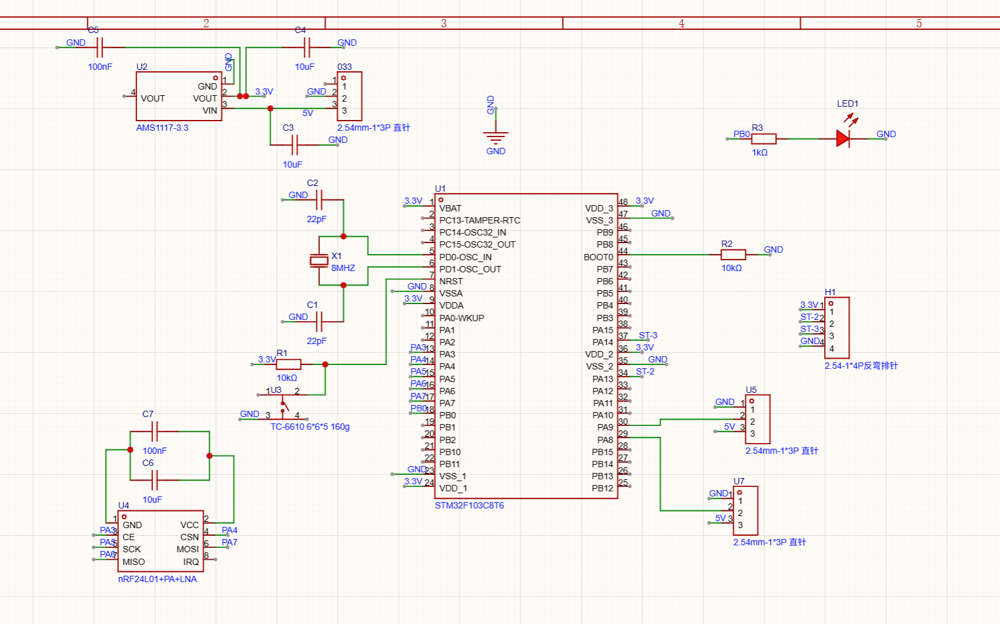
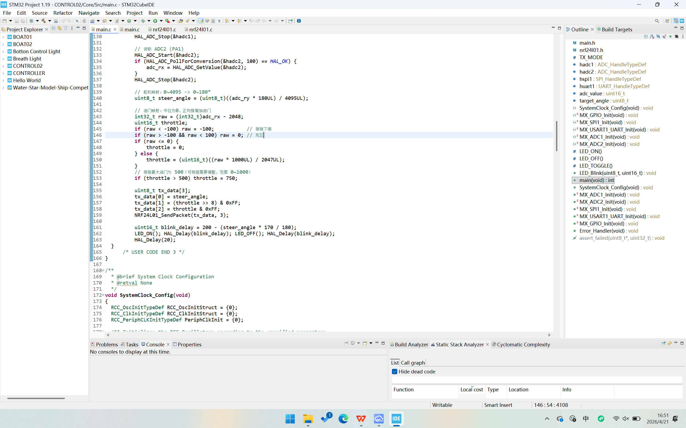

## 项目简介

这是一个偏软硬件结合的完整项目，核心目标是完成遥控器与船载接收器的无线控制系统。系统分为手持遥控端和船载接收端：遥控端读取摇杆输入并打包发送，接收端解析数据后分别控制舵机方向和电机油门，最终形成从人手输入到船体执行机构的闭环。

## 我负责的部分

- 担任队长、主程与硬件设计，负责把遥控端、接收端、PCB、焊接和整机联调串成可运行版本。
- 独立完成 `CONTROL02` 遥控端和 `BOAT02` 船载端的主要代码，包括 ADC 采样、数据打包、NRF24L01 通信、PWM 舵机控制和电调油门控制。
- 设计 3 字节控制协议：第 1 字节表示舵机角度，后 2 字节表示油门值，接收端按同一格式解包并执行。
- 参与硬件连接与调试，通过 3.3V 供电、滤波电容、晶振、nRF24L01 模块和外部接口完成遥控器/船载端的电路闭环。
- 针对摇杆中位抖动和电调安全启动做处理，在代码中加入油门死区、限幅、LED 自检反馈和电调校准流程。

## 技术实现

- 遥控端基于 STM32F103C8T6 和 HAL，分别读取 PA0 / PA1 两路 ADC：一路映射为 0-180 度舵机角度，另一路围绕中位值做死区判断后映射为 0-1000 油门量。
- 遥控端将角度与油门打包成 `tx_data[3]`，通过 NRF24L01 发送；通信模块使用 SPI1、5 字节地址、2.402GHz 频道、1Mbps 速率和自动重发配置。
- 船载端进入 NRF24L01 接收模式后读取同样的 3 字节载荷，将角度交给 `Servo_SetAngle`，将油门交给 `Motor_SetThrottle`。
- 舵机使用 TIM2 PWM 输出，按 0.5ms-2.5ms 脉宽映射 0-180 度；电调使用 TIM1 PWM 输出，按 1ms-2ms 脉宽映射 0-1000 油门。
- 船载端启动时先让舵机居中，再进行 NRF24L01 自检和电调校准；异常时用 LED 慢闪停机，正常时用快闪反馈通过。
- 硬件侧使用嘉立创 EDA 绘制 PCB 并完成焊接，结合 3.3V 稳压、并联电容和电源滤波降低无线模块供电不稳带来的问题。

## 系统结构

- 输入层：遥控端摇杆输出模拟量，STM32 通过 ADC1 / ADC2 采样并转换为方向和油门控制量。
- 通信层：`nrf24l01.c` 封装寄存器读写、发送、接收、自检、TX/RX 模式切换和 FIFO 清理，两端保持相同地址和载荷宽度。
- 执行层：船载端用 TIM2 控制舵机角度，用 TIM1 控制电调油门，把无线数据转为实际运动。
- 保护与反馈层：油门死区避免中位抖动，限幅保护输出范围，LED 用于启动、自检、异常和油门状态反馈。
- 硬件层：PCB 承担供电、通信模块、晶振、状态灯和外部接口连接，保证软件控制链路能稳定落到实物上。

整理成控制流程后，整套系统从摇杆到执行机构是一条很直接的输入-通信-输出链：

我在实现时尽量让协议保持小而明确：遥控端只发送角度和油门，船载端只负责解包、限幅和输出 PWM。这样调试时可以按层定位问题：先看 ADC 是否稳定，再看 `tx_data[3]` 是否正确，再看 NRF24L01 是否收包，最后看舵机和电调是否响应。

## 截图与工程展示

引脚配置围绕 STM32F103C8T6 展开，包含 ADC 输入、SPI 通信、USART 调试和基础 GPIO 输出。

原理图包含 3.3V 稳压、电源滤波、晶振、nRF24L01 通信模块、状态指示灯和外部接口。

代码侧完成 ADC 采样、油门/舵机映射、3 字节数据包发送、nRF24L01 接收解包、PWM 输出和状态灯反馈，形成遥控器到船端执行机构的控制链路。

## 项目结果

- 成为少数完赛队伍，并进入决赛阶段。
