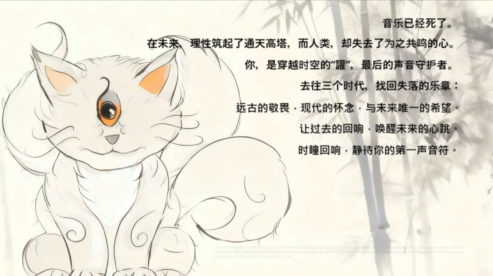
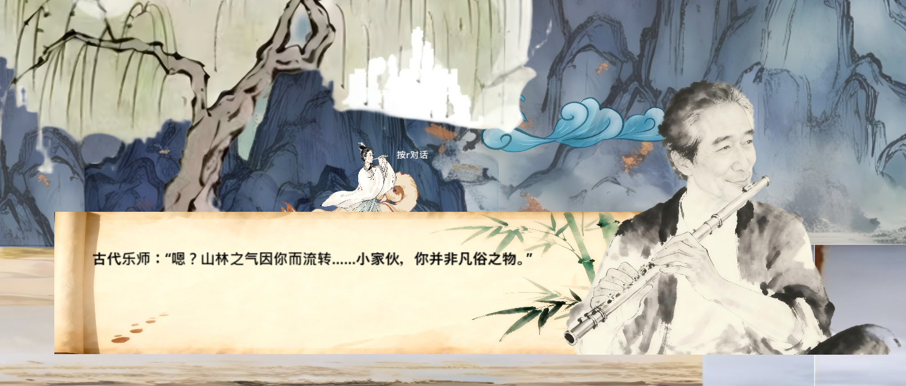
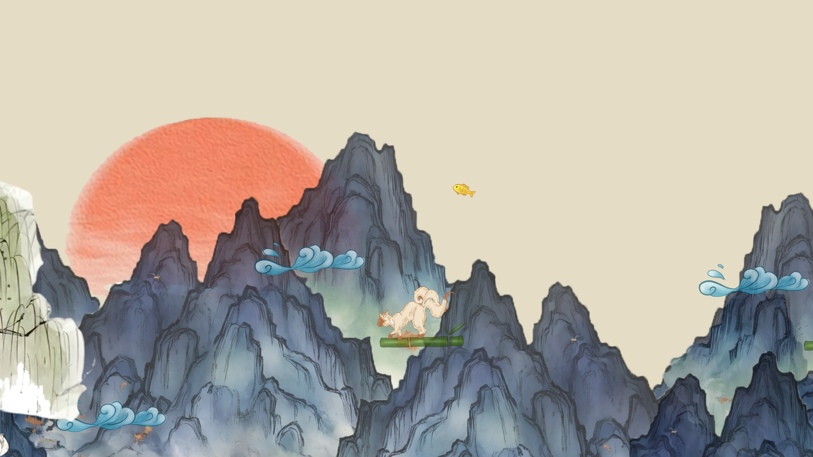
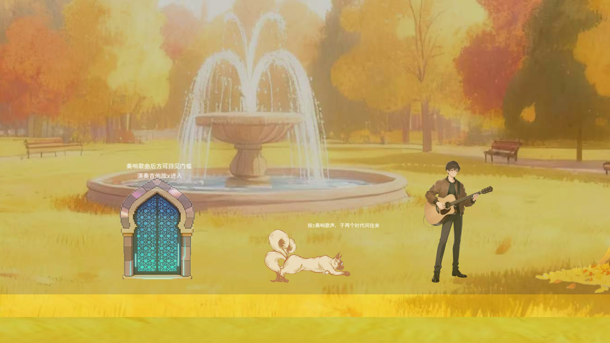
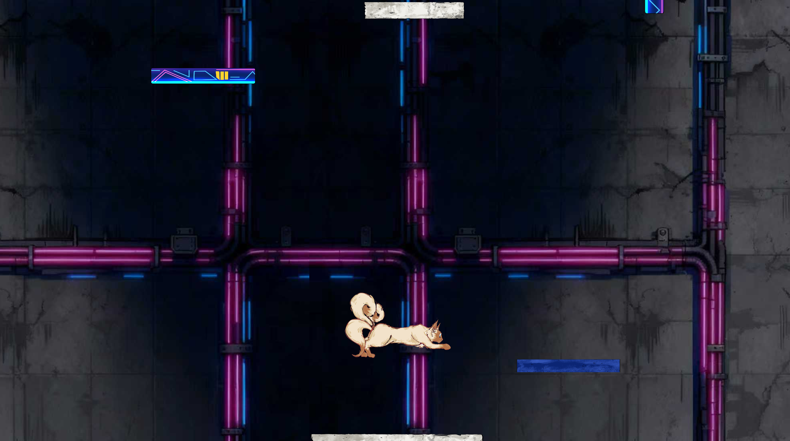
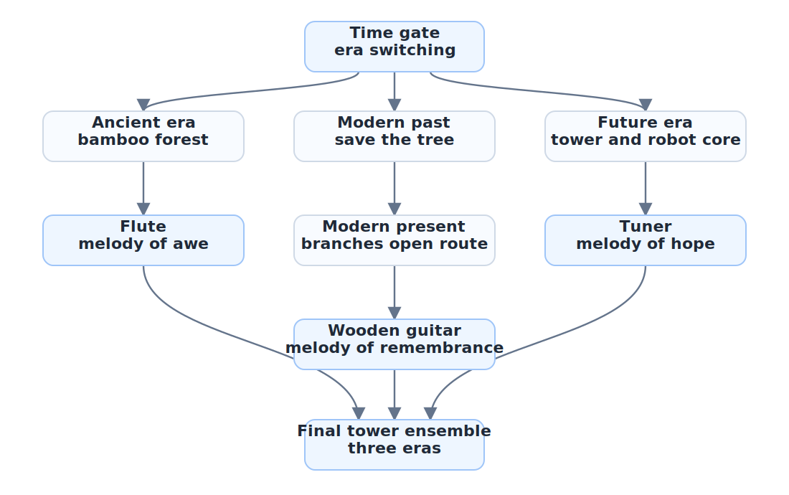

## Overview

Echoes of Time is an early Limenauts team project created for the 2025 Autumn Sanjiao Cup Game Jam. I served as team lead, main designer, writer, and gameplay designer. The player controls a cat-like mythical creature inspired by Huan from ancient Chinese mythology, traveling through ancient, modern, and future versions of the same place. Across the journey, the player collects instruments and melodies, eventually bringing the echoes of three eras into a future where music has disappeared.

The central question of the project is: why does music matter, and what do humans lose when music vanishes? Our answer was expressed through both narrative and mechanics: music is not only sound, but also emotion, memory, cultural identity, and one of the most direct forms of human connection.

## World and Theme

The story takes place in a future where music has died. Technology has built towers higher and higher, while humans have gradually lost their sensitivity to their own inner lives. As a time-traveling Huan, the player returns to the past and the present to recover awe, remembrance, and the last hope of the future.

The "echo" in the title has two meanings. It refers to music traveling across eras, and also to the way choices made in the past reshape the future. The protagonist does not simply save the world; they help people remember how to listen again.

## Core Gameplay

The game is built around three timelines of the same location. The ancient, modern, and future maps correspond spatially, but buildings, trees, roads, and towers change as time passes.

- Ancient era: cross the lake, enter the bamboo forest, collect Echo Bamboo, bring it to the ancient musician, craft a flute, and learn the melody of awe.
- Modern era: travel to a recent past, use nutrient fluid to save a dying tree, return to the present, climb the revived tree to reach a rooftop, collect a wooden guitar, and learn the melody of remembrance.
- Future era: search a cyberpunk wasteland tower for a robot core, repair the damaged robot, receive a tuner, climb to the top, and perform the final movement.

The platforming layer uses wall jumps, conditional double jumps, and timeline switching. Players need to read what changes and what remains in different eras, then alter the past to open paths in the present and future.

## Screenshots and Scenes

The opening image introduces the world in a quiet tone: music is disappearing together with humanity, and the protagonist Huan is the last guardian of sound.

The ancient act connects the flute and musician to the theme of awe, tying music to nature, mountains, and older memories.

The ancient level uses ink-wash mountains, bamboo, clouds, and light platforms to create a poetic sense of movement.

The modern act places the park, fountain, guitarist, and time gate in one scene, carrying the melody of remembrance.

The future act shifts into a darker cyberpunk space. Platforms and pipes create a colder, more oppressive contrast with the earlier eras.

## Narrative Structure

The three acts correspond to three forms of musical memory.

- Ancient musician and flute: music as awe, the first act of listening to nature and life.
- Modern guitarist Su Wang and wooden guitar: music as remembrance, connecting people with cities, old trees, and personal emotion.
- Future robot and tuner: music as hope, the last protocol left after civilization has nearly lost its voice.

In the ending, the ancient musician, modern songwriter, and future robot symbolically join the protagonist on top of the tower. The sounds of the past travel across the future city, awakening a heart that has gone cold.

## My Role

- Served as lead designer and team coordinator, building the world setting, three-act structure, core mechanics, and level flow.
- Wrote the main design document, post-jam revised design document, character dialogue, ending narration, and art requirement documents.
- Translated the idea of "one place across three eras" into executable level layouts and asset lists.
- Coordinated programmers, artists, and musicians by clarifying character actions, scene assets, interactive props, and performance needs.
- Participated in debugging, map design, partial art support, and flow integration.

## Technical and Production Design

The project used Godot as the development environment. My design work focused on turning a complex time-travel concept into a structure that programmers and artists could implement quickly.
I reorganized this page around the production workflow: define the transformation rules for one place across three eras, then break that into player actions, puzzle props, NPC dialogue, and final performance beats. Its technical value is not a single complex script, but the way I compressed a broad narrative idea into tasks the team could advance day by day.

- Broke down character behavior for programming: movement, wall jump, roll, conditional double jump, interaction triggers, and timeline switching.
- Broke down layered art assets: distant backgrounds, tileable ground, temporary platforms, characters, NPCs, key props, and interactive buildings.
- Designed transformation rules for the same location across eras, such as an ancient house becoming a modern villa and later a future tower.
- Built the "save the tree" puzzle as the core example: the player changes the tree's fate in the past, returns to the present, and uses the revived branches to reach a previously inaccessible rooftop.
- Planned the final performance sequence: three instruments sound in order, echoes of past musicians appear, the robot joins with future electronic music, and the ending resolves into an orchestral finale.

## System Structure

This project was not driven by a complex code architecture. My main contribution was turning the timeline narrative into a level structure the team could actually build. The production was organized into five layers:

- Timeline structure: ancient, modern, and future eras share the logic of one location, while buildings, roads, and reachable paths change across eras.
- Player action layer: movement, wall jump, roll, conditional double jump, and time-gate interaction give the platforming layer its exploration rhythm.
- Puzzle-prop layer: Echo Bamboo, flute, nutrient fluid, wooden guitar, robot core, and tuner each move one era's task chain forward.
- Narrative presentation layer: NPC dialogue, melody rewards, era themes, and the final ensemble connect gameplay results back to story.
- Team-production layer: design documents, art requirement lists, and daily meetings broke maps, assets, text, and programming tasks into deliverable units.

As a flow, the player experience is not just moving through maps, but building cause and effect across eras:

This better reflects my role: I was not only writing lore, but breaking "one place across three eras" into routes, props, NPCs, scenes, and performance requirements so the team could move along one emotional curve within seven days.
In the portfolio, this project now occupies the "team design and production breakdown" position. It is less code-heavy than the later Unity works, but it shows how I connect worldbuilding, mechanics, maps, and collaboration rhythm.

## Design Highlights

The most important design attempt in Echoes of Time was to make time travel feel like understanding the history of one place rather than simply loading three unrelated maps. The player sees a single space grow, change, and lose its voice across eras.

The ancient lake and bamboo forest, the modern park and tree, and the future tower and robot form one emotional curve: awe in nature, remembrance in the city, and hope in a future ruin. Music ties these moments together as the thread between time, place, and human feeling.
